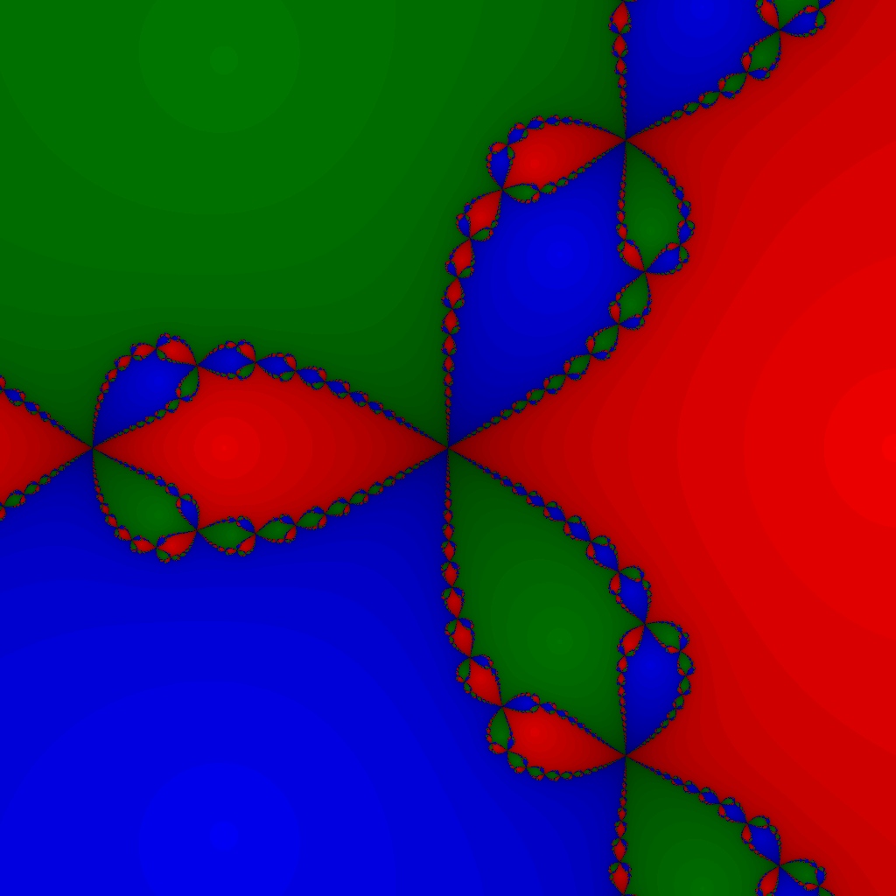

# ASCII Art Fractals

<!--
	FILENAME: README.md
	AUTHOR: Zachary Krepelka
	DATE: Wednesday, January 3rd, 2024
	ORIGIN: https://github.com/zachary-krepelka/ascii-art-fractals.git
	UPDATED: Monday, February 5th, 2024 at 12:54 AM
-->

My goal with this project is to *gain experience programming in different
languages.*  In this project, I implement the same program over and over again,
but each time, I do it in a different programming language.  The program is
simple enough for me to write on a weekend once I've learned the rudiments of a
language, but it's far more rewarding than a trivial `Hello, World!` program.  I
was inspired to pursue this project after reading [Programming Language
Explorations][1].

# Program Introduction

The program that I write is intended for the command-line interface, and it's
small enough to be contained within a single source file.  It takes no input[^1]
and outputs a small ASCII art image with ANSI coloring.  Namely, the program
generates a [Newton fractal][2] image corresponding to the 3rd-degree
polynomial $p(z) = z^3 - 1$.[^2]  The output will look like this[^3], but in
ASCII art:

# Featured Languages

They are listed in the order that I wrote the programs with them.  I hope to
make this list longer in the coming year.

1. Java
2. JavaScript
3. CoffeeScript
4. Lua
5. Python
6. Ruby
7. Julia
8. PHP

It's interesting to observe GitHub's language bar on the side of the screen.
Each language is used once for the same purpose and in the same manner, so in
this circumstance, the language bar seems to suggest the brevity of each
language for this particular task. You will notice that Julia occupies the
smallest portion of the bar. Julia is well suited for mathematical and
scientific computation.

# Abbreviations

I use a number of abbreviations consistently throughout this project.

| Abbreviation | Meaning                               | Variable | Function |
| ------------ | ------------------------------------- | -------- | -------- |
| abs          | absolute value                        | &cross;  | &check;  |
| arg          | the [argument][3] of a complex number | &check;  | &check;  |
| cis          | a [mathematical notation][4]          | &cross;  | &check;  |
| coeff        | coefficient                           | &check;  | &cross;  |
| der          | derivative                            | &check;  | &cross;  |
| diff         | differentiate                         | &cross;  | &check;  |
| dist         | distance                              | &cross;  | &check;  |
| dot          | [dot product][5]                      | &cross;  | &check;  |
| exp          | exponent                              | &check;  | &cross;  |
| max          | maximum                               | &check;  | &cross;  |
| poly         | polynomial                            | &check;  | &cross;  |
| pow          | power                                 | &cross;  | &check;  |
| px           | pixel                                 | &check;  | &cross;  |
| re, im       | the components of complex number      | &check;  | &cross;  |
| scl          | scale                                 | &cross;  | &check;  |
| tol          | tolerance                             | &check;  | &cross;  |
| z, w         | complex numbers                       | &check;  | &cross;  |

<!-- References and Footnotes -->

[1]: https://rtoal.github.io/ple/
[2]: https://en.wikipedia.org/wiki/Newton_fractal
[3]: https://en.wikipedia.org/wiki/Argument_(complex_analysis)
[4]: https://en.wikipedia.org/wiki/Cis_(mathematics)
[5]: https://en.wikipedia.org/wiki/Dot_product

[^1]: Later I will consider expanding each of the program implementations to
  support command-line input.  This will entail writing a basic command-line
  argument parser in each language.

[^2]:The program actually addresses the general case of an
  nth-degree, integer polynomial of a single variable.  The
  3rd-degree polynomial is passed as a hard-coded argument to a
  function accepting the general case as a parameter.

[^3]:I also wrote a full-fledged Newton fractal image generator, outputting
  image files as apposed to text.  The featured image was generated with that
  program.  Sooner or later, I will upload that to GitHub too.  Full details
  about Newton fractals will be provided there.
